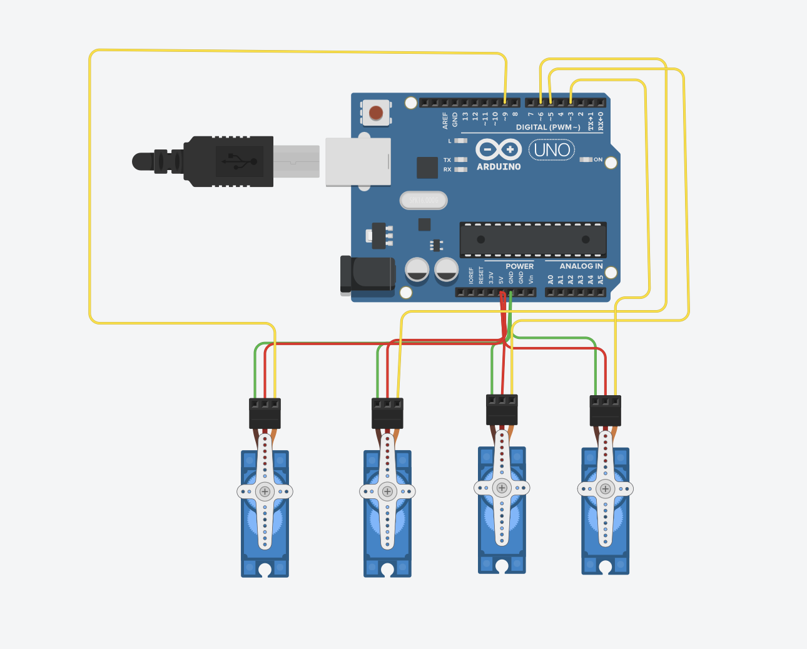

# Four Servo Motors Sweep

## Introduction
This project controls four servo motors using an Arduino board. The motors perform a sweep motion for 2 seconds, then all motors hold at 90 degrees.

## Components
- Arduino Uno
- 4 Servo Motors
- Jumper Wires
- Breadboard
- External power supply if needed

## Pin Connections
| Servo Motor | Arduino Pin |
|------------|-------------|
| Servo 1 | 3 |
| Servo 2 | 5 |
| Servo 3 | 6 |
| Servo 4 | 9 |

## How It Works
1. The four servo motors are connected to Arduino pins 3, 5, 6, and 9.
2. The motors move using the sweep motion from 0 to 180 degrees and back.
3. The sweep motion runs for 2 seconds.
4. After 2 seconds, all servo motors hold at 90 degrees.

## Code Logic
The project uses the Servo library and the `millis()` function to control the timing.  
The variable `startTime` stores the time when the program starts, and the motors keep sweeping until 2 seconds pass.

## Tinkercad Circuit Simulation

The circuit was built and tested using Tinkercad.  
The image below shows the Arduino Uno connected to four servo motors.

## Simulation Demo

The video below shows the four servo motors moving with the sweep motion for 2 seconds, then stopping at 90 degrees.

[Watch Simulation Video](simulation-video.mp4)

## Conclusion
This project demonstrates how to control multiple servo motors using Arduino and how to stop them at a fixed angle after a specific time.
